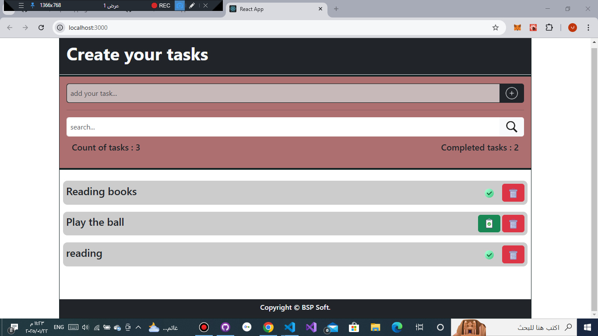
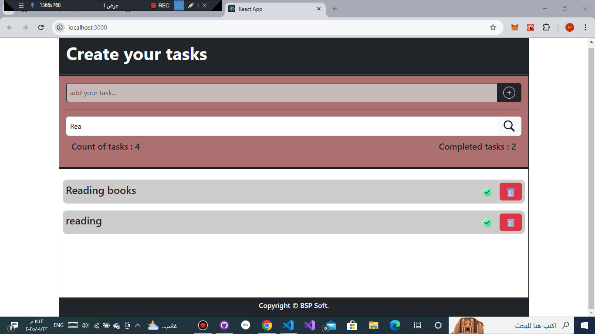

# تطبيق إدارة المهام - React

تطبيق بسيط لإدارة المهام اليومية تم تطويره باستخدام React. يوفر التطبيق واجهة تفاعلية تتيح للمستخدم إضافة مهام جديدة، تعديل حالتها (مكتملة أو غير مكتملة)، حذف المهام، والبحث عن مهمة معينة بسهولة.

---

## **المميزات**
- **إضافة مهمة جديدة**: يمكن للمستخدم إنشاء مهمة جديدة مع إدخال التفاصيل اللازمة.
- **تعديل حالة المهمة**: يمكن تبديل حالة المهمة بين مكتملة وغير مكتملة بنقرة واحدة.
- **حذف المهام**: إمكانية حذف المهام غير الضرورية.
- **البحث عن المهام**: شريط بحث مخصص للعثور على المهام باستخدام النص المدخل.

---

## **التقنيات المستخدمة**
- **React**: مكتبة JavaScript لبناء واجهات المستخدم.
- **CSS**: لتنسيق وتصميم واجهة المستخدم.
- **React Hooks**: لإدارة حالة التطبيق مثل `useState` و`useEffect`.

---
## Topics
- React
- Html
- css

---

## **كيفية تشغيل المشروع**

1. قم بتحميل المشروع أو استنساخه باستخدام الأمر:
   ```bash
   git clone https://github.com/BSPSoft/task.git
   ```

2. انتقل إلى مجلد المشروع:
   ```bash
   cd task
   ```

3. قم بتثبيت الحزم المطلوبة:
   ```bash
   npm install
   ```

4. قم بتشغيل التطبيق:
   ```bash
   npm start
   ```

5. افتح المتصفح وانتقل إلى:
   ```
   http://localhost:3000
   ```

---

## **الوظائف الرئيسية**

### 1. إضافة مهمة
- قم بكتابة اسم المهمة في حقل الإدخال واضغط على زر "إضافة" لإضافتها إلى القائمة.

### 2. تعديل حالة المهمة
- يمكنك النقر على مربع بجانب المهمة لتبديل حالتها بين "مكتملة" و"غير مكتملة".

### 3. حذف مهمة
- اضغط على زر الحذف بجانب المهمة لحذفها من القائمة.

### 4. البحث عن مهمة
- استخدم شريط البحث في أعلى التطبيق لكتابة اسم المهمة وستظهر المهام المطابقة.

---

## **صور من التطبيق**
### 1. واجهة التطبيق الرئيسية:


### 2. البحث عن المهام:


---

## **التطوير المستقبلي**
- إضافة تصنيفات للمهام (مثل: شخصية، عمل، دراسة).
- توفير خيار لتعديل نص المهمة بعد إضافتها.
- إنشاء واجهة مستخدم مظلمة (Dark Mode).

---

## **المساهمة**
مرحب بجميع المساهمات لتحسين هذا المشروع! يمكنك فتح مشكلة (Issue) أو إرسال طلب دمج (Pull Request) عبر GitHub.

---

## **المؤلف**
- **اسمك هنا**
- [GitHub](https://github.com/BSPSoft)

---

## **الترخيص**
هذا المشروع مرخص تحت رخصة [MIT](LICENSE).
